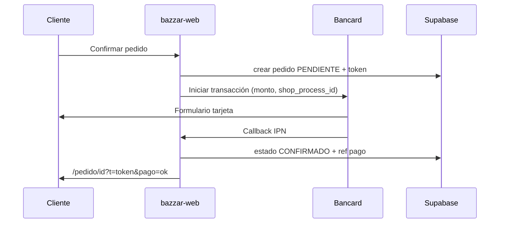

# Solicitud de servicios Bancard — Bazzar Paraguay

**Comercio:** Bazzar  
**Sitio:** https://www.bazzar.com.py  
**Contacto técnico:** _(completar)_  
**RUC / razón social:** _(completar)_

---

## 1. Objetivo

Habilitar cobro en línea con **Bancard VPOS / e-commerce** para pedidos web confirmados en bazzar-web (Paraguay — Guaraníes).

---

## 2. Documentación habitual (verificar con ejecutivo Bancard)

- [ ] Copia RUC vigente
- [ ] Identificación representante legal
- [ ] Constancia cuenta bancaria para liquidación
- [ ] Descripción del rubro (retail calzado / e-commerce)
- [ ] Volumen estimado mensual de transacciones
- [ ] URL del sitio en producción
- [ ] Política de privacidad y términos (URLs públicas)

---

## 3. Datos técnicos para el formulario Bancard

| Campo | Valor propuesto |
|-------|-----------------|
| URL sitio | `https://www.bazzar.com.py` |
| URL éxito pago | `https://www.bazzar.com.py/pedido/{id}?pago=ok` |
| URL cancelación | `https://www.bazzar.com.py/checkout?pago=cancelado` |
| Webhook / IPN | `https://www.bazzar.com.py/api/payments/bancard/callback` |
| Moneda | PYG |
| Métodos | Tarjetas débito/crédito locales |

---

## 4. Variables de entorno (post-aprobación)

```env
BANCARD_PUBLIC_KEY=
BANCARD_PRIVATE_KEY=
BANCARD_COMMERCE_CODE=
BANCARD_ENV=sandbox   # sandbox | production
BANCARD_CALLBACK_SECRET=
```

Implementación stub: `lib/payments/bancard.ts`  
Route handler (fase 2): `app/api/payments/bancard/callback/route.ts`

---

## 6. Estado corredor técnico (ETAPA-002)

| Pieza | Archivo | Producción |
|-------|---------|------------|
| Config | `lib/payments/bancard.ts` | Stub |
| Iniciar pago | `POST /api/payments/bancard/init` | Stub 503 sin credenciales |
| Webhook IPN | `POST /api/payments/bancard/callback` | Stub — requiere `BANCARD_CALLBACK_SECRET` |
| Checkout UI | Coordinación manual + WhatsApp | ✅ Operativo |

**Conclusión:** El corredor Bancard está **documentado y cableado**, pero **no procesa pagos** hasta credenciales comerciales. Lanzamiento fase 1 = pedido web + pago manual.

---

## 7. Contacto Bancard

- Web: https://www.bancard.com.py  
- Producto: **VPOS / Pagos en línea para comercios**

Registrar fecha de contacto y número de caso:

| Fecha | Canal | Referencia | Responsable |
|-------|-------|------------|-------------|
| _pendiente_ | | | |

---

## 6. Flujo de pago previsto (post-integración)



---

*Completar tabla de contacto al enviar la solicitud comercial.*
